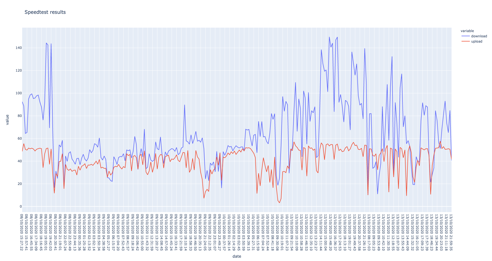

## Installation

Run:

`pip install requirements.txt`

## Running

The program uses speedtest-cli to run speedtest every 15 minutes. 

To collect speedtest data run

`python run_speedtest.py`

To show data run

`python plot_speedtest_results.py`

You should see something like this:

